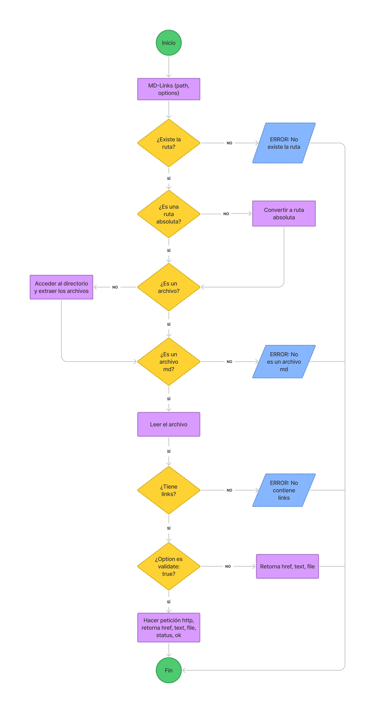
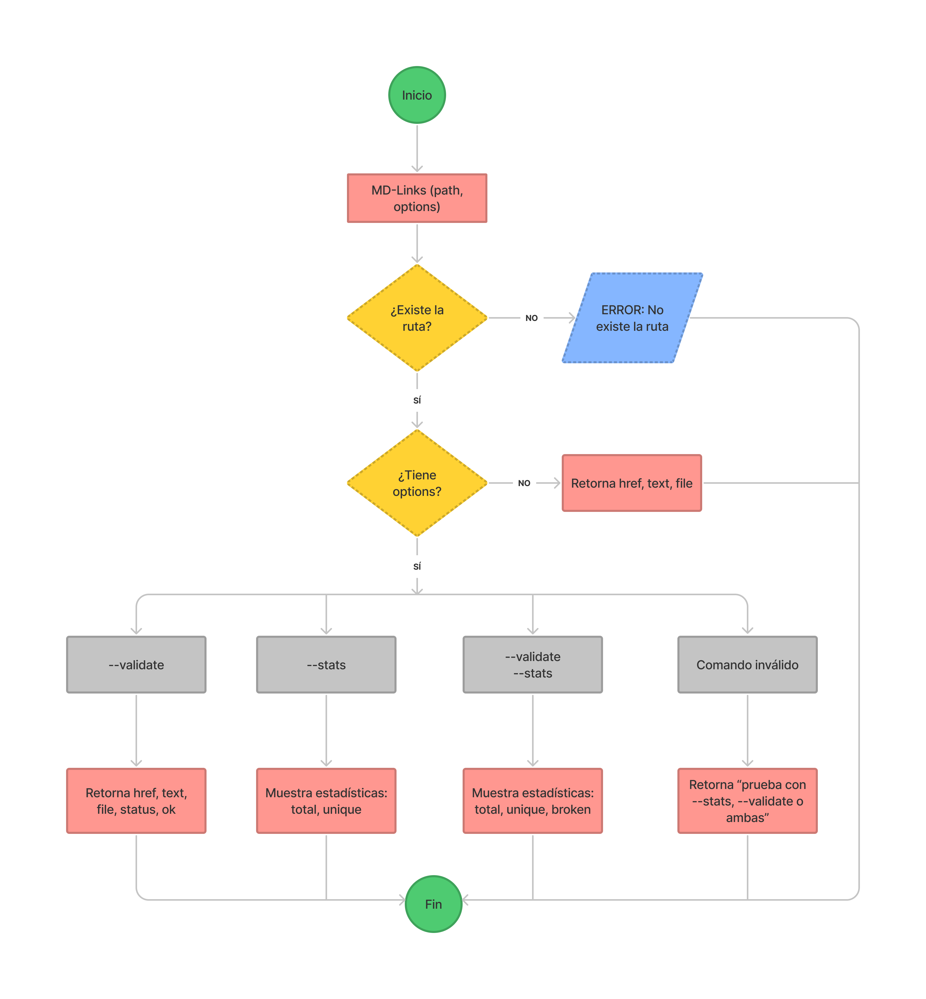

# Md Blank Space by Shiran

Md-blank-space es una libreria creada a partir de NodeJS, la cual va a verificar el estado de los links en archivos con lenguaje markdown.

## 1. Flujograma

### 1.1 Flujograma API



### 1.1 Flujograma CLI




## 2. Guía de uso

### 2.1 Instalación

```sh
npm i md-blank-space
```

### 2.2 Uso de librería

```sh
const md-links = require('md-blank-space');
```

## 3.  CLI (Command Line Interface - Interfaz de Línea de Comando)

El ejecutable de nuestra aplicación debe poder ejecutarse de la siguiente
manera a través de la **terminal**:

`md-links <path-to-file> [options]`

Por ejemplo:

```sh
$ md-links ./carpeta-completa
    href: 'https://es.wikipedia.org/wiki/Markdown',
    text: 'Markdown',
    file: 'C:\\Users\\PC\\LIM016-md-links\\carpeta-completa\\file-con-links.md'
```

El comportamiento por defecto no debe validar si las URLs responden ok o no,
solo debe identificar el archivo markdown (a partir de la ruta que recibe como
argumento), analizar el archivo Markdown e imprimir los links que vaya
encontrando, junto con la ruta del archivo donde aparece y el texto
que hay dentro del link (truncado a 50 caracteres).

#### Options

##### `--validate`

Si pasamos la opción `--validate`, el módulo debe hacer una petición HTTP para
averiguar si el link funciona o no. Si el link resulta en una redirección a una
URL que responde ok, entonces consideraremos el link como ok.

Por ejemplo:

```sh
$ md-links ./carpeta-completa --validate
    href: 'https://laboratoria.la/lapizza',
    text: 'Laboratoria',
    file: 'C:\\Users\\PC\\LIM016-md-links\\carpeta-completa\\file-con-links.md',    
    status: 404,
    ok: 'fail'
```

Vemos que el _output_ en este caso incluye la palabra `ok` o `fail` después de
la URL, así como el status de la respuesta recibida a la petición HTTP a dicha
URL.

##### `--stats`

Si pasamos la opción `--stats` el output (salida) será un texto con estadísticas
básicas sobre los links.

```sh
$ md-links ./carpeta-completa --stats
Total: 3
Unique: 3
```

#### `--stats --validate`

Si pasamos la opción `--stats --validate` el output (salida) será un texto con estadísticas
básicas sobre los links y además un detalle de la cantidad de links rotos (broken).

```sh
$ md-links ./carpeta-completa --stats --validate
Total: 3
Unique: 3

Broken: 1
```


#### `--help`


📌 Realizado por Shiran Olave Terrazas.